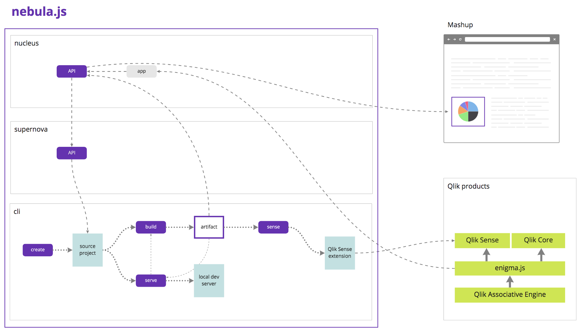

# nebula.js

`nebula.js` is a collection of JavaScript libraries and APIs that enables you to build visualizations and mashups on top of Qlik's Associative Engine.

It consists of three parts:

- `nucleus`: A product and framework agnostic JavaScript library that helps you build mashups.
- `supernova`: A JavaScript API that helps you consume and visualize QIX data.
- `cli`: Tools to help you create, develop and build a `supernova`.



## Getting started

### Prerequisites

- node.js `v8.0.0+`
- Qlik Engine
  - which comes bundled with one of the following products
    - Qlik Sense Desktop
    - Qlik Sense Enterprise (coming soon)
  - or by running it in a Docker container through either
    - Qlik Core
    - or the `qlikcore/engine` image

### Creating a new project

The easiest way to get started is to create a new project using the nebula CLI through `npx`:
```sh
npx @nebula.js/cli@next create hello-sunshine
```

or by doing a global install and running the `nebula` command:

```sh
npm install @nebula.js/cli@next -g
nebula create hello-sunshine
```

This will create a directory called `hello-sunshine` with the following content:

```sh
hello-sunshine
├─ README.md
├─ package.json
├─ .editorconfig
├─ .eslintrc.json
├─ .gitignore
└─ src
   ├─ index.js
   └─ object-properties.js
```

The `package.json` contains a few built-in npm commands:

#### `npm start`

Starts a web development server.

The server needs to connect to a running instance of Qlik Engine and by default assumes it's already running on port `9076`. If you don't have Qlik Sense desktop installed you can opt-in to start a Docker image of Qlik Engine by accepting the [Qlik Core EULA](https://core.qlik.com/eula/):

```sh
ACCEPT_EULA=yes npm start
```

#### `npm run build`

Builds the supernova for production into the `dist` folder. At this stage you can publish the supernova to npm using the command `npm publish`.

#### `npm lint`

Checks for code syntax issues.
