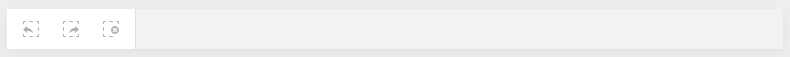
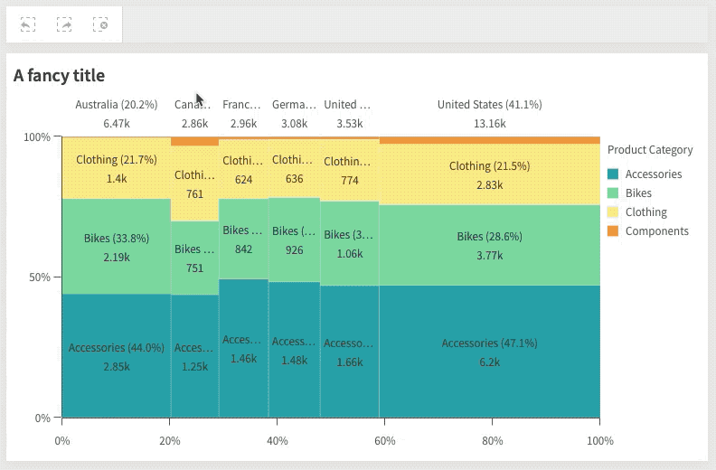
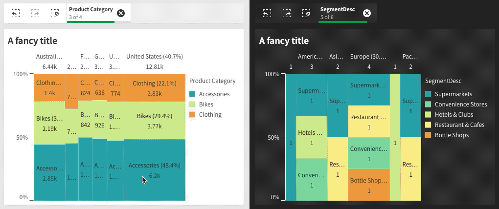

An essential part of the Qlik experience is filtering data through selections. Most charts support selections in the data they render, which will then filter out data and affect other charts connected to the same data model.

## Current app selections bar

The current app selections bar shows you the currently active selections in the specified app. To render this bar you need an `HTMLElement` first:

```html
<div class="curr-selections"></div>
```

You can then `mount` the selections UI into that element:

```js
const n = nucleus(enigmaApp);

await (n.selections()).mount(document.querySelector('.curr-selections');
```

Without any selections it should like this:



As you start applying selections in the various charts, the UI will update to reflect the current state:



## Multiple bars

If you are connected to multiple apps, you can show the current selections in each one by mounting the bar into different elements:

```js
await nucleus(enigmaApp)
  .selections()
  .mount(document.querySelector('.curr-selections'));

await nucleus(anotherApp, { context: { theme: 'dark' } })
  .selections()
  .mount(document.querySelector('.another-curr-selections'));
```


