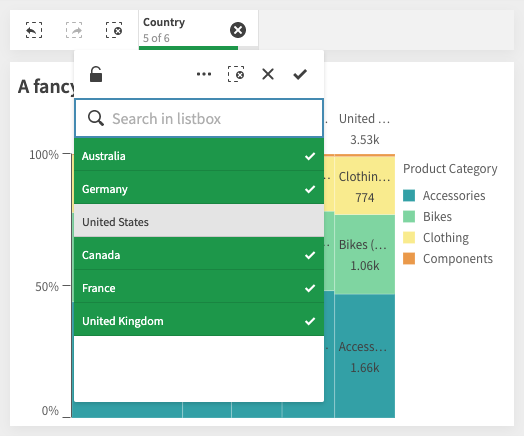
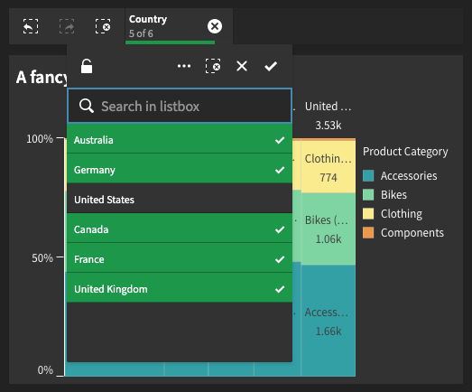
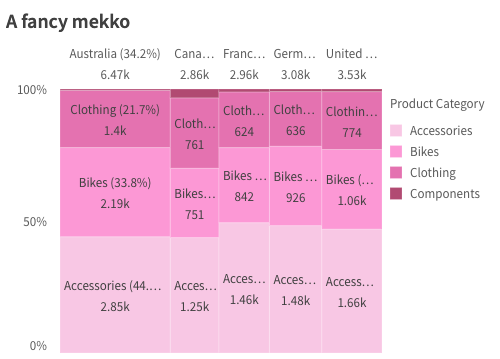

When you are building a website, whether it's a company wide site or a small personal project, you most likely have your own design guidelines, UX patterns and requirements, and would want to apply those guidelines on the things you integrate with it; charts should use your color schemes, fonts, locale and respect any restrictions you may have on interactivty. You may also want to control how charts and themes are loaded based on whether your solution is online or offline.

You can control most of these through the `Configuration` object for `nucleus`.

## Temporary config

The `nucleus` module is a function that requires an `enigmaApp` and an optional `config` object, which you then can use to render charts:

```js
const n = nucleus(enigmaApp, {
  context: {
    theme: 'dark',
  },
  types: [
    /* types */
  ],
});

n.render(/* chart 1*/);
n.render(/* chart 2*/);
```

## Reusable config

If you are working with multiple apps, or want to have multiple different configurations it might be easier for you to create the configurations first and then reuse those.

Create a `baseConfig` which does the heavy lifting of registering types and themes:

```js
const baseConfig = nucleus.createConfiguration({
  types: [
    /* register type once*/
  ],
  themes: [
    /* register themes once*/
  ],
});
```

Create another configuration which inherits from the `baseConfig`, apply a `'dark'` theme and set a constraint to disallow selection:

```js
const noSelectionDark = baseConfig.createConfiguration({
  context: {
    theme: 'dark',
    constraints: { select: true },
  },
});

// render chart with dark theme with no selections allowed
noSelectionDark(enigmaApp).render(/*chart config*/);
noSelectionDark(anotherEnigmaApp).render(/*chart config*/);
```

You can also bind the config to an app directly:

```js
const swedishPink = baseConfig(enigmaApp, {
  context: {
    theme: 'pinkish',
    language: 'sv-SE',
  },
});

swedishPink.render(/* chart config */);
```

## Registering types

Before rendering a supernova type, its module needs to be loaded and registered. You can load the modules you know you will need from npm:

```bash
$ npm install @nebula.js/sn-bar-chart @nebula.js/sn-pie-chart
```

And then register each one individually:

```js
import barchart from '@nebula.js/sn-bar-chart';
import piechart from '@nebula.js/sn-pie-chart';

nucles.createConfiguration({
  types: [
    {
      type: 'bar',
      load: () => Promise.resolve(barchart),
    },
    {
      type: 'pie',
      load: () => Promise.resolve(piechart),
    },
  ],
});
```

### Loading on the fly

If you don't know exactly which types you will need and want to avoid installing everything to reduce the size of your bundle, you could load the visualizations at runtime using a lighweight AMD loader like [d3-require](https://github.com/d3/d3-require).

Start by installing the module:

```bash
npm install d3-require
```

and then configure it to load modules from a CDN like `https://unpkg.com`, as well as specify an alias to use the local version of `@nebula.js/supernova`:

```js
import { requireFrom } from 'd3-require';
import * as supernova from '@nebula.js/supernova';

const loadSnType = requireFrom(name => `https://unpkg.com/@nebula.js/sn-${name}-chart`).alias({
  '@nebula.js/supernova': supernova,
});
```

You can then configure all types you expect might be used:

```js
const types = ['bar', 'line', 'pie', 'sankey'].map(t => ({
  type: t,
  load: () => loadSnType(t),
}));
const baseConfig = nucleus.createConfiguration({ types });
```

The type will be loaded from the remote url the first time you render it:

```js
baseConfig(enigmaApp).render({
  type: 'bar',
  fields: ['Product', '=sum(Sales)'],
});
```

## Context

When setting up the configuration you can apply a `context` which controls the language, theme and constraints in the supernova types you render:

```js
nucleus.createConfiguration({
  context: {},
});
```

### Constraints

Constraints enables you to instruct supernova types to disable certain types of interactions and behaviour.

There are three different constraints you can apply:

- `passive`: disable interactions like tooltips.
- `active`: disable interactions that affect the state of the visual representation like zoom, scroll, etc.
- `select`: disable selections

```js
{
  context: {
    constraints: {
      active: true,
      passive: true,
      select: true,
    },
  },
};
```

`nucleus` does not enforce these constraints in any way, instead it is up to the supernova developer to respect and implement them.

### Language

`nucleus` supports 15 languages:

- `'en-US'` - American English
- `'sv-SE'` - Swedish
- `'it-IT'` - Italian
- `'zh-CN'` - Simplified Chinese
- `'zh-TW'` - Traditional Chinese
- `'ko-KR'` - Korean
- `'de-DE'` - German
- `'es-ES'` - Spanish
- `'pt-BR'` - Brazilian Portuguese
- `'ja-JP'` - Japanese
- `'fr-FR'` - French
- `'nl-NL'` - Dutch
- `'tr-TR'` - Turkish
- `'pl-PL'` - Polish
- `'ru-RU'` - Russian

```js
{
  context: {
    language: 'sv-SE',
  },
};
```

### Theme

There are two main themes provided out of the box: `'light'` and `'dark'`.

```js
{
  context: {
    theme: 'dark',
  }
};
```

| Light theme                            | Dark theme                           |
| -------------------------------------- | ------------------------------------ |
|  |  |

You can also register custom themes and apply one of those on the context:

```js
{
  themes: [{
    id: 'pinkish',
    load: () => Promise.resolve({
      palettes: {
        data: [{
          scale: [
            '#fac6e5',
            '#ff95d6',
            '#e76eb1',
            '#b44772',
          ],
        }]
      }
    })
  }],
  context: {
    theme: 'pinkish'
  }
};
```



## Snapshots

TODO

Read more:

- [API reference](#TODO)
- [Theme API](#TODO)
