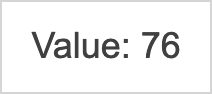
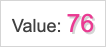

Plugins can be used to add or modify a visualization. Nebula provides a way to pass in plugins (through the `render` function of an `embed` instance), and to access provided plugins (through the `usePlugins` hook in the chart implementation).

## Render with plugins

```js
embed(app).render({
  element,
  type: 'my-chart',
  plugins: [plugin],
});
```

## How to implement a plugin

A plugin needs to be an object literal, including plugin info (`name`) and a function, `fn`, in which the plugin is implemented.

```js
const plugin = {
  info: {
    name: 'example-plugin',
  },
  fn: () => {
    // Plugin implementation goes here
  },
};
```

The `info` object is a suitable place to add more meta information if needed. Input and return value of the `fn` function is up to the plugin implementation to decide based on its purpose.

## Accessing plugins in chart implementation

Plugins passed at rendering can be accessed through the `usePlugins` hook in the following way:

```js
import { usePlugins } from '@nebula.js/stardust';
// ...
const plugins = usePlugins();
plugins.forEach((plugin) => {
  // Invoke plugin
  plugin.fn();
});
```

## A simple example

A visualization rendering a random value.

```js
import { useElement, useEffect, usePlugins } from '@nebula.js/stardust';

export default function supernova() {
  return {
    component() {
      const element = useElement();
      const plugins = usePlugins();
      useEffect(() => {
        const randomValue = Math.random().toFixed(2) * 100;
        let valueHtml;
        if (plugins[0] && plugins[0].info.type === 'value-html') {
          valueHtml = plugins[0].fn(randomValue);
        } else {
          valueHtml = `<span>${randomValue}</span>`;
        }

        element.innerHTML = `<div>Value: ${valueHtml}</div>`;
      }, []);
    },
  };
}
```

The visualization looks for provided plugins with `type` set to "value-html", and if that is present it invokes the plugin to get html for the value element, which it inserts into the DOM.

### Rendering with a simple plugin

```js
const pinkStylePlugin = {
  info: {
    name: 'styling-plugin',
    type: 'value-html',
  },
  fn(value) {
    return `<span style="font-family: Arial; font-size: 25px;
      text-shadow: 2px 2px 0px #d5d5d5; color: deeppink;">${value}</span>`;
  },
};

// ...
embed(app).render({
  'simple-vis',
  element: el,
  plugins: [pinkStylePlugin],
});
```

|               No plugin               |                     With plugin                     |
| :-----------------------------------: | :-------------------------------------------------: |
|  |  |
