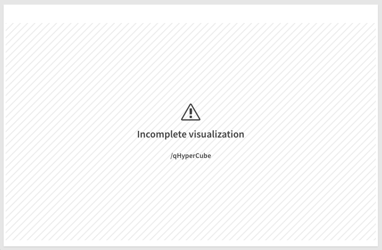
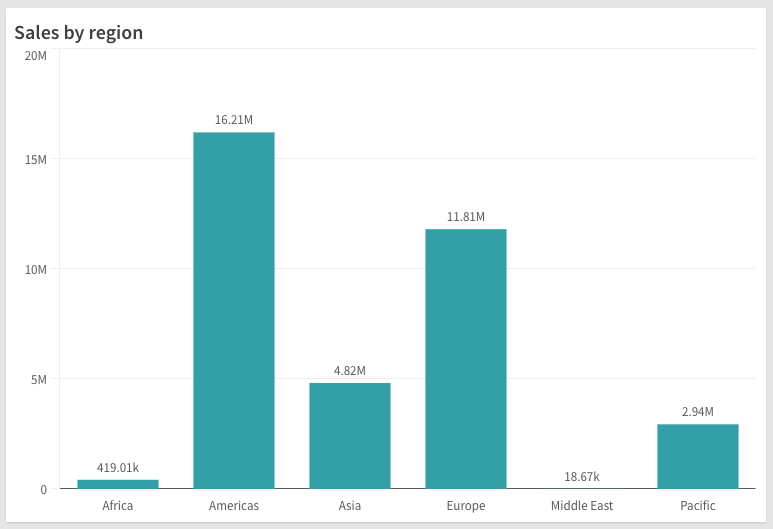

You can render a supernova in two ways:

1. On the fly
1. From existing object

Rendering is done using the `render()` method on the `nucleus` instance, which at minimum requires the `HTMLElement` you want to render into:

```js
const n = nucleus(enigmaApp);
n.render({
  element,
  // rest of the config
});
```

## Render on the fly

When rendering a supernova on the fly you need to specify the `type` of supernova to render:

```js
n.render({
  element,
  type: 'barchart',
});
```

Some supernovae have minimum requirements on the various properties and/or data it needs in order to render, in which case you might see something like this:



To provide initial data to the supernova, add the data dimensions and measures into the `fields` property:

```js
n.render({
  element,
  type: 'barchart',
  fields: ['Region', '=sum(Sales)'],
});
```

You can also modify the initial properties of the supernova:

```js
n.render({
  element,
  type: 'barchart',
  fields: ['Product', '=sum(Sales)'],
  properties: {
    title: 'Sales by region',
  },
});
```



Read more

- [API reference](./nucleus-reference#nucleusrendercfg)
- [API reference per supernova](#TODO)

## Render from existing objects

If you already have created a generic object in your app and want to render it, you can do so by providing the object's `id`:

```js
n.render({
  element,
  id: '<ObjectID>',
});
```
