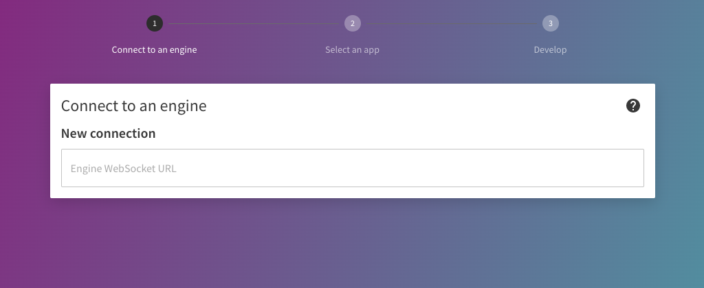
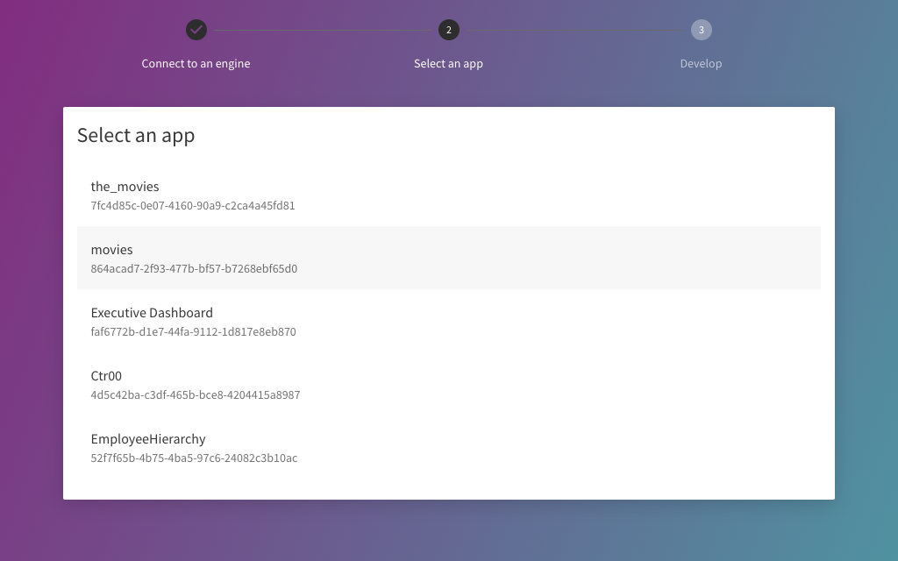
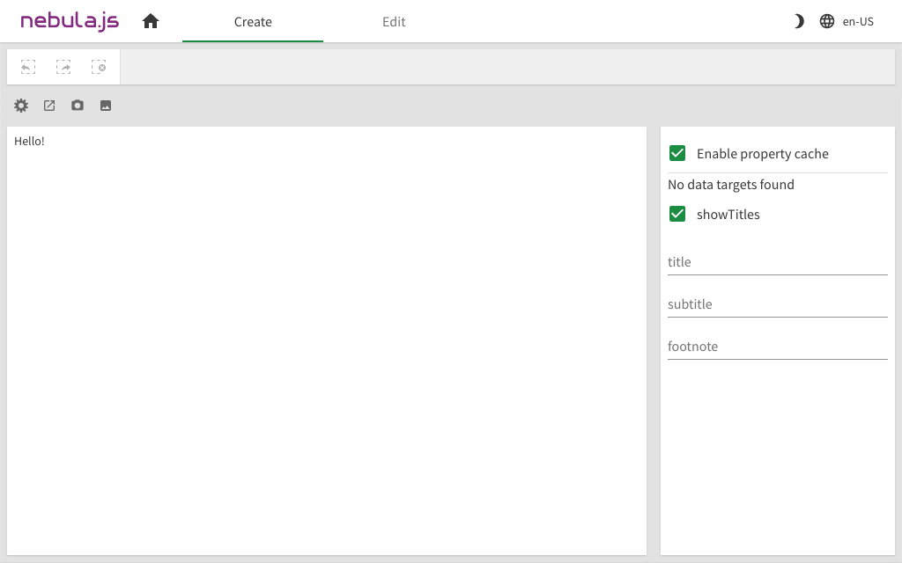
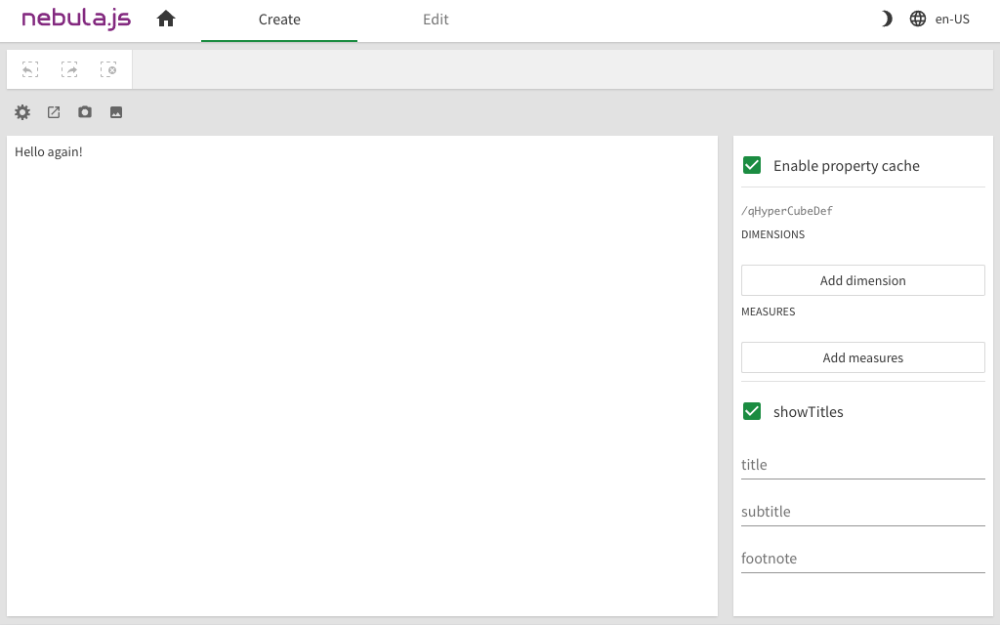
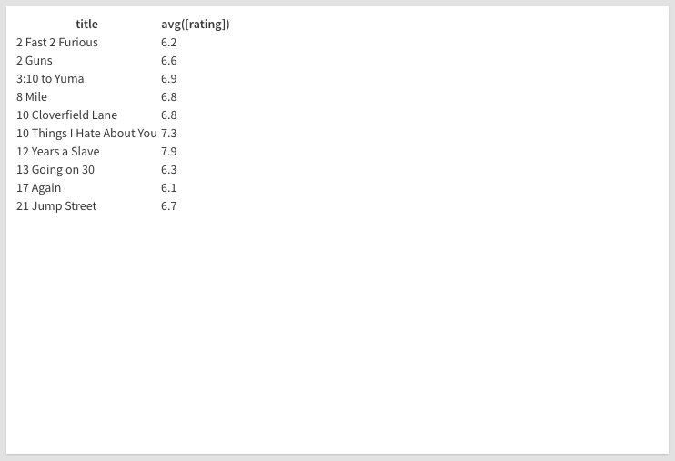

This guide will walk you through creating a simple project that renders a table.

It will include the following steps:

1. Create a project
1. Configure data structure
1. Render data
1. Select data

and requires that you have:

- Access to a Qlik Sense installation.
- `node.js` `v10.0.0+` installed on your machine.
- A decent IDE, we recommend [VSCode](https://code.visualstudio.com/).

## Create a project

The quickest way to get started is to use the `nebula.js` CLI:

```bash
$ npx @nebula.js/cli create hello --picasso none
```

The command will scaffold a project into the `hello` folder with the following structure:

- `/src`
  - `index.js` - Main entry point of this visualization
  - `object-properties.js` - Object properties stored in the app
  - `data.js` - Data configuration
- `/test` - Integration tests
- `package.json`

The folder contains some additional dotfiles that provides linting and formatting of code.

### Start the development server

Start the development server with:

```bash
$ cd hello
$ npm run start
```

The command will start a local development server and open up http://localhost:8080 in your browser.



The development server needs to connect to a Qlik Associative Engine running in any Qlik deployment. Enter the WebSocket URL that corresponds to the Qlik product you are using.

Next, select an app to connect to.



You will then be redirected to the main developer UI where you should see your visualization rendered:



Any updates in `/src/index.js` that affects the output will automatically cause a refresh of the visualization and you will see the changes immediately.

## Configure data structure

A simple `Hello` message is not really that useful, time to add some data.

Add a `qHyperCubeDef` definition in `object-properties.js`:

```js
const properties = {
  qHyperCubeDef: {
    qInitialDataFetch: [{ qWidth: 2, qHeight: 10 }],
  },
  // ...
};
```

Then add that hypercube as a data target in `data.js`:

```js
export default {
  targets: [
    {
      path: '/qHyperCubeDef',
    },
  ],
};
```

With only those changes you should now have the option to add data from the property panel on the right:



Add a dimension by clicking on **Add dimension** and selecting a value in the menu that appears, do the same with measure.

## Render data

In order to render the data you first need to access it through the `useLayout` hook:

```js
import { useElement, useLayout } from `@nebula.js/stardust`;

// ...
component() {
  console.log(useLayout());
}
```

You can then `useLayout` in combination with `useEffect` to render the headers and rows of data in `qHyperCube`:

```js
component() {
  const element = useElement();
  const layout = useLayout();

  useEffect(() => {
    if (layout.qSelectionInfo.qInSelections) {
      // skip rendering when in selection mode
      return;
    }
    const hc = layout.qHyperCube;

    // headers
    const columns = [...hc.qDimensionInfo, ...hc.qMeasureInfo].map((f) => f.qFallbackTitle);
    const header = `<thead><tr>${columns.map((c) => `<th>${c}</th>`).join('')}</tr></thead>`;

    // rows
    const rows = hc.qDataPages[0].qMatrix
      .map((row) => `<tr>${row.map((cell) => `<td>${cell.qText}</td>`).join('')}</tr>`)
      .join('');

    // table
    const table = `<table>${header}<tbody>${rows}</tbody></table>`;

    // output
    element.innerHTML = table;

  }, [element, layout])
}
```



## Select data

Before selecting data, we need to add some meta data on each row so that we know which one to select:

```js
// rows
const rows = hc.qDataPages[0].qMatrix
  .map((row, rowIdx) => `<tr data-row="${rowIdx}">${row.map((cell) => `<td>${cell.qText}</td>`).join('')}</tr>`)
  .join('');
```

And then add a `'click'` event handler on `element` which does the following:

- Verifies that the clicked element is a `td`
- Begins selections in `/qHyperCubeDef` if not already activated
- Extracts the `data-row` index from `tr`
- Updates `selectedRows` based on the click `data-row`

```js
const element = useElement();
const selections = useSelections();
const [selectedRows, setSelectedRows] = useState([]);

useEffect(() => {
  const listener = (e) => {
    if (e.target.tagName === 'TD') {
      if (!selections.isActive()) {
        selections.begin('/qHyperCubeDef');
      }
      const row = +e.target.parentElement.getAttribute('data-row');
      setSelectedRows((prev) => {
        if (prev.includes(row)) {
          return prev.filter((v) => v !== row);
        }
        return [...prev, row];
      });
    }
  };

  element.addEventListener('click', listener);

  return () => {
    element.removeEventListener('click', listener);
  };
}, [element]);
```

Next, update the styling of the selected rows in the table whenever they change:

```js
useEffect(() => {
  if (!layout.qSelectionInfo.qInSelections) {
    // no need to update when not in selection mode
    return;
  }
  element.querySelectorAll('tbody tr').forEach((tr) => {
    const idx = +tr.getAttribute('data-row');
    tr.style.backgroundColor = selectedRows.includes(idx) ? '#eee' : '';
  });
}, [element, selectedRows]);
```

Finally, apply the selected values through the `selections` API:

```js
useEffect(() => {
  if (selections.isActive()) {
    if (selectedRows.length) {
      selections.select({
        method: 'selectHyperCubeCells',
        params: ['/qHyperCubeDef', selectedRows, []],
      });
    } else {
      selections.select({
        method: 'resetMadeSelections',
        params: [],
      });
    }
  } else if (selectedRows.length) {
    setSelectedRows([]);
  }
}, [selections.isActive(), selectedRows]);
```
