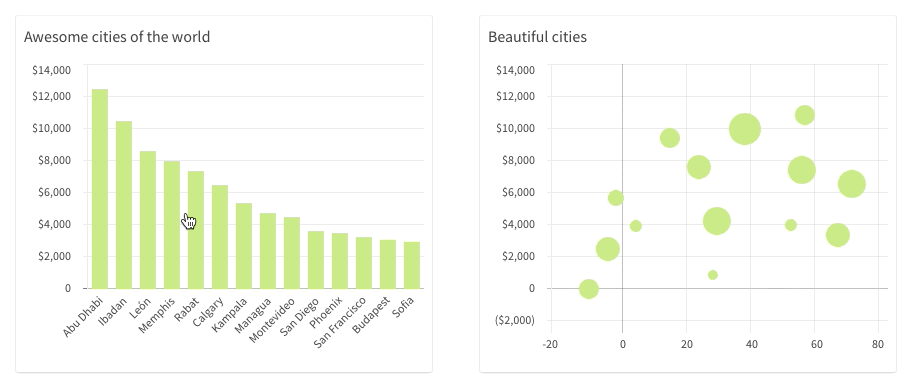
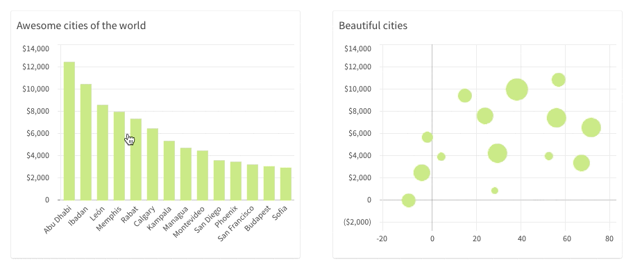

Selections is a fundamental part of Qlik's Associative Engine. All fields and the associations between them are contained within the Associative Model. When you apply a selection you are not only applying a filter in the data model, but also exposing the associations between your data sources.

## Applying selections

Selections can be applied with methods exposed on the model returned from the `useModel` hook.

Since a generic object can hold multiple hypercubes, you always need to specify which hypercube you want to select in by providing the JSON path of it as the first argument:

```js
import { useModel } from '@nebula.js/stardust';
// ...
component() {
  const model = useModel();

  useEffect(() => {
    model.selectHyperCubeCells('/qHyperCubeDef', [1], []);
  }, [model])
}
```

## Selection patterns

There are two different patterns of selections: instant and modal.

### Instant selections

As the name indicates, this type of pattern is immediate and will filter both the source of the selections and everything that is affected by it.

In the following example, as soon as a value is selected in the bar chart, the filtering is applied instantaneously and both charts are immediately updated with the filtered data:



### Modal selections

When a modal selection is initiated, the source of the selection enters a form of modal state that allows a user to modify selections before confirming the changes.

In the following example, the user first selects one value in the bar chart, at which point other charts are updated just as before. The bar chart however still has all the data available and allows the user to select another value, before confirming the changes and updating the bar chart itself:



To implement this type of pattern you need to `useSelections` in combination with `useModel` and follow a few simple steps:

1. Enter the modal state by calling `beginSelections`.
1. Select values.
1. Provide visual feedback to the user of what has been selected by for example changing the opacity of selected values.
1. Keep track of when the modal state has been exited in order to reset the visual feedback.

```js
import { useModel, useSelections, useElement } from '@nebula.js/stardust';
// ...
component() {
  const element = useElement();
  const model = useModel();
  const selections = useSelections();

  useEffect(() => {
    const clicked = () => {
      const clickedOnRow = 1;

      // 1. enter modal state if not already in it
      if (!selections.isActive()) {
        selections.beginSelections(['/qHyperCubeDef']);
      }
      // 2. select the clicked row
      model.selectHyperCubeCells('/qHyperCubeDef', [clickedOnRow], []);
    }

    element.addEventListener('click', clicked);
    return () => {
      element.removeEventListener('click', clicked);
    }
  }, [element, model, selections]);

  useEffect(() => {
    if (layout.qSelectionInfo.qInSelections) {
      // 3. update with visual feedback on active selections
      // YOUR CODE HERE
    } else {
      // 4. normal update
      // YOUR CODE HERE
    }
  }, [layout]);
}
```
