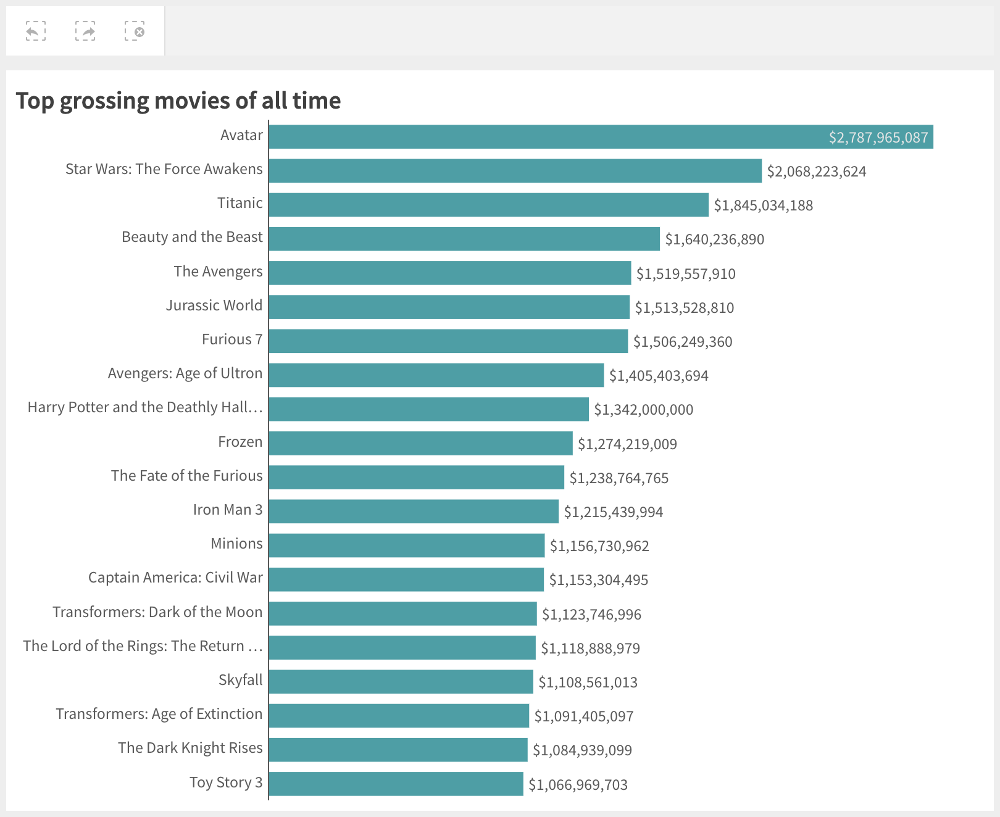

This guide will walk you through creating a simple mashup that connects to Qlik Sense and visualizes some data.

It will include the following steps:

1. Setup a Qlik Cloud Services account
1. Create a simple web project
1. Configure connection
1. Visualize data

and requires that you have:

- `node.js` `v10.0.0+` installed on your machine
- A decent IDE, we recommend [VSCode](https://code.visualstudio.com/).

## Setup up a Qlik Cloud Services account

Though `nebula.js` works and can be integrated with all Qlik Sense products, this will guide you on how to integrate with Qlik Cloud Services.

Perform the following steps:

1. [Register for a subscription on Qlik Cloud Services](https://help.qlik.com/en-US/cloud-services/Subsystems/Hub/Content/Sense_Hub/Introduction/qcs-register.htm).
1. [Configure your deployment](https://help.qlik.com/en-US/cloud-services/Subsystems/Hub/Content/Sense_Hub/Introduction/qcs-tenant-domain.htm).
1. [Create a new web integration](https://help.qlik.com/en-US/cloud-services/Subsystems/Hub/Content/Sense_Hub/Admin/mc-adminster-web-integrations.htm) from the [Management console](https://help.qlik.com/en-US/cloud-services/Subsystems/Hub/Content/Sense_Hub/Admin/management-console.htm).
   1. You will later on run the mashup from your local machine, to allow this connection to happen you should add `http://localhost:1234` to the whitelist of origins.
   1. Once the web integration has been created an ID will be assigned to it, this is the `qlik-web-integration-id` you will need later on.
1. [Upload an app](https://help.qlik.com/en-US/cloud-services/Subsystems/Hub/Content/Sense_Hub/Apps/create-app-cloud-hub.htm)
   1. If you don't have an app or data already prepared, you can [download the movies dataset](https://github.com/qlik-oss/nebula.js/raw/master/data/apps/the_movies.qvf) from the github repository and upload it to the cloud.

Each app in QCS has a global unique identifier (GUID) which you will need later on.
The GUID can be extracted from the URL and is the part that follows `/app`. For example, if the URL is `https://qcs.us.qlikcloud.com/sense/app/7fc4d85c-0e07-4160-90a9-c2ca4a45fd81`, then the GUID of the app is `7fc4d85c-0e07-4160-90a9-c2ca4a45fd81`.

## Create a simple web project

The quickest way to create a web project is to use the `nebula.js` command line interface:

```bash
npx @nebula.js/cli create mashup hello-qcs
```

The command will scaffold a web project into the `hello-qcs` folder with the following structure:

- `/src`
  - `configure.js` - Initial configuration of `nebula.js`
  - `connect.js` - Connection setup with `enigma.js`
  - `index.html` - A minimal html page
  - `index.js` - Connect and visualize

`/src/index.js` is where you will need to make modifications later on to bring everything together.

## Configure connection

To configure the connection you will need your QCS tenant url, the `qlik-web-integration-id` and the GUID of the app you want to open.

Open up `src/index.js` and update the `<>` placeholders with the correct values, for example:

```js
const app = await connect({
  url: 'https://qcs.us.qlikcloud.com',
  webIntegrationId: '8Ys9sBVyq6i2lxtclPWaaZhQr7OgwKaT',
  appId: '7fc4d85c-0e07-4160-90a9-c2ca4a45fd81',
});
```

## Visualize data

The movies dataset you uploaded earlier has a bar chart on the first sheet with the id `EAjjuyE`, you can render that same bar chart in your mashup by providing the id and an element to render the visualization into:

```js
n.render({
  element: document.querySelector('.object'),
  id: 'EAjjuyE',
});
```

Start the web development server by executing the following in a terminal:

```
npm run start
```

The server will run on [http://localhost:1234](http://localhost:1234).

When opening the page, you may be re-routed to your QCS tenant to login if the session timed out since you did the setup. Once logged in, you will be re-routed back to the develoment server where you should see the same bar chart:



The visualization is fully interactive, any selections you make will be reflected in the current app selections toolbar at the top.

## More visualizations

### Render on the fly

You can render a visualization without having to create it in the app by providing the `type` and some data `fields`:

```js
n.render({
  element: document.querySelector('.object'),
  type: 'barchart',
  fields: ['title', '=avg(rating')],
});
```

### More types

The core modules of `nebula.js`do not contain any visualizations by themselves, each visualization is its own separate module and needs to be loaded and registered before it can be used.

Official supernova modules from Qlik are published under the `@nebula.js` scope and are prefixed with `sn-`.

The available visualizations are as follows:

- Bar chart: `@nebula.js/sn-bar-chart`
- Line chart: `@nebula.js/sn-line-chart`
- Pie chart: `@nebula.js/sn-pie-chart`
- Sankey chart: `@nebula.js/sn-sankey-chart`
- Funnel chart: `@nebula.js/sn-funnel-chart`
- Mekko chart: `@nebula.js/sn-mekko-chart`

The template you created your mashup from only includes the `bar-chart` module, you can add more types by installing each one you want to use:

```bash
npm install @nebula.js/sn-pie-chart
```

Then modify `/src/configure.js` to include the new modules:

```js
import piechart from '@nebula.js/sn-pie-chart';
//...

nucles.createConfiguration({
  // ...
  types: [
    // ...
    {
      name: 'piechart',
      load: () => Promise.resolve(piechart)
    }
  ]
}
```
